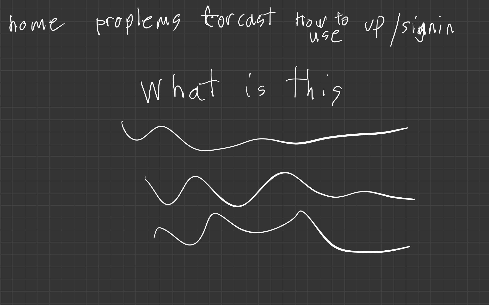
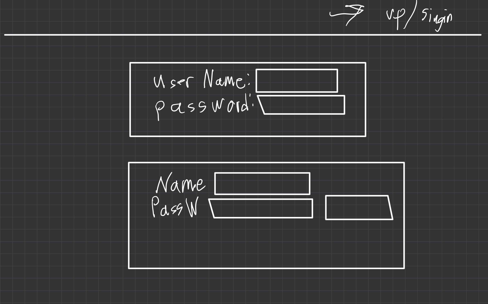
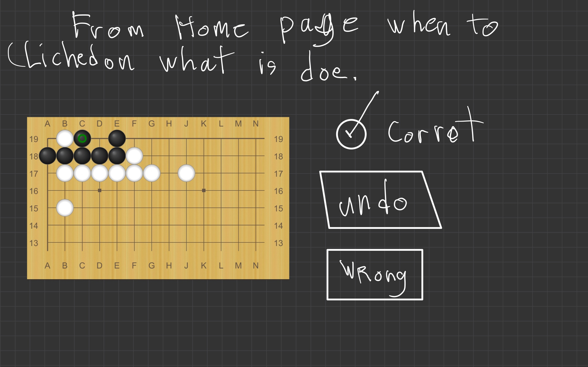
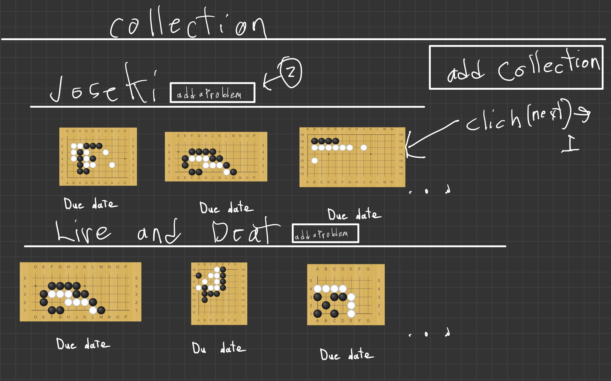
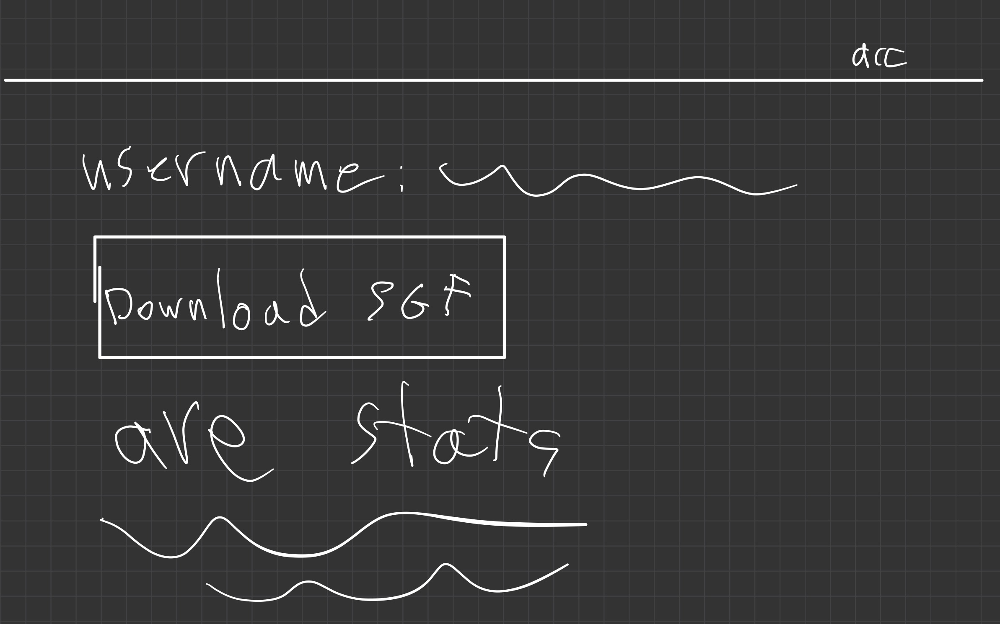
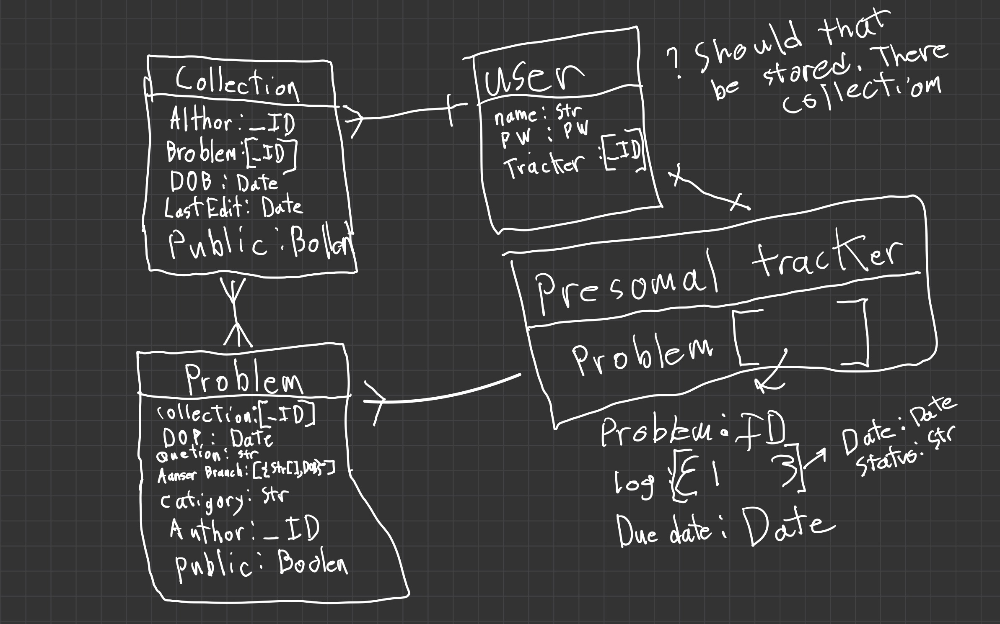
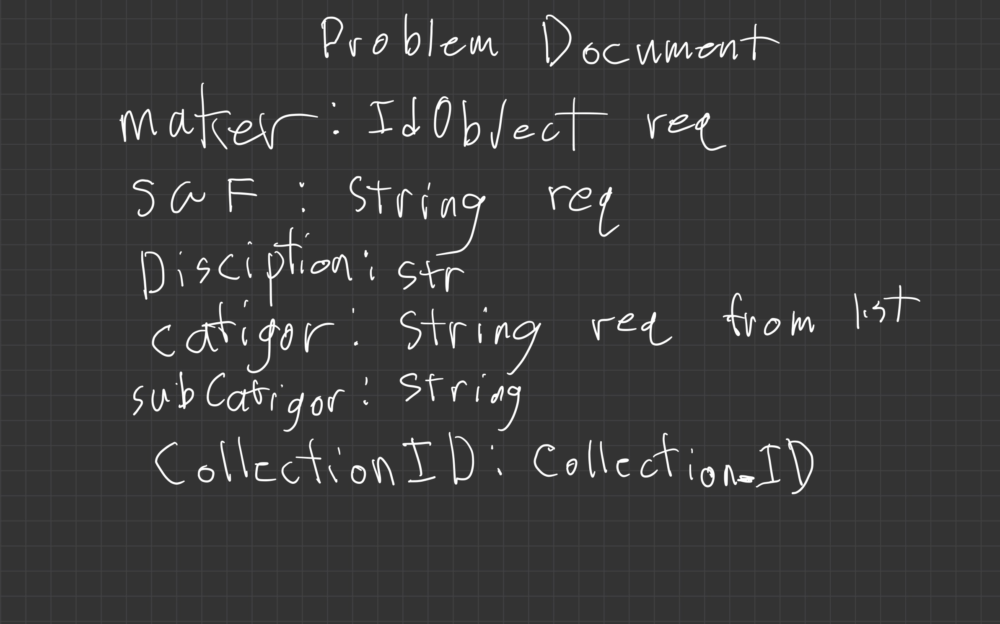

User will go to the home page and see soemthing like this. nav bar and what the website is about.

next is the wignin and up page. I don't like the sign up easer to find when I want to sign in. So I put the sing in ablove the sign up, even though I probably braking some annoy good practice rule.

This will now take the user to the homepage that will now desplay differently. Problems that are due that day. With obtion to do them by colloction/catigory or just all that do that day.

Now the only thing left is to do the problem. If complete mark it as so and move on. If user got it wrong, then mark it so and move on. Until you are done.

User done. Back to the homepage that is empty, so he click over on collections in the nav. The picture here will show all the problems the user has. Regardless of due date. Grouped together. Calling this collection. (Best to see data digram to understand.)

This is the show page. This where you would make edits as well. Or even delete it.

User needs to add problems. So he will need to upload them, and add them to a catigory.

There a how to use page. Give people ideas on how they can use it. Like study joseki or add problems from a book they are going through, or maybe something they seen they like to try and resee to learn.

User gets a page with stats how many problems and so on.

Data structure Ideas

